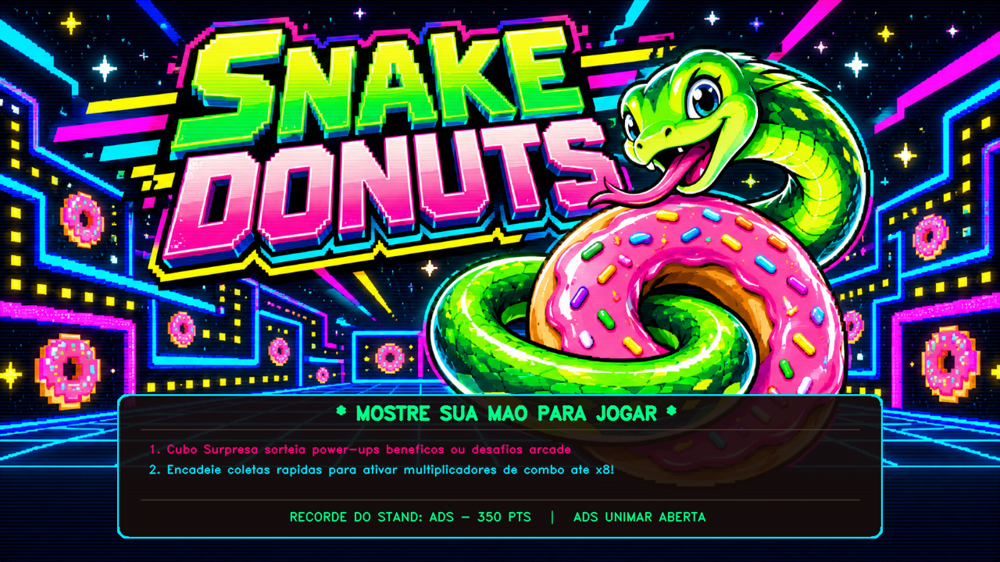
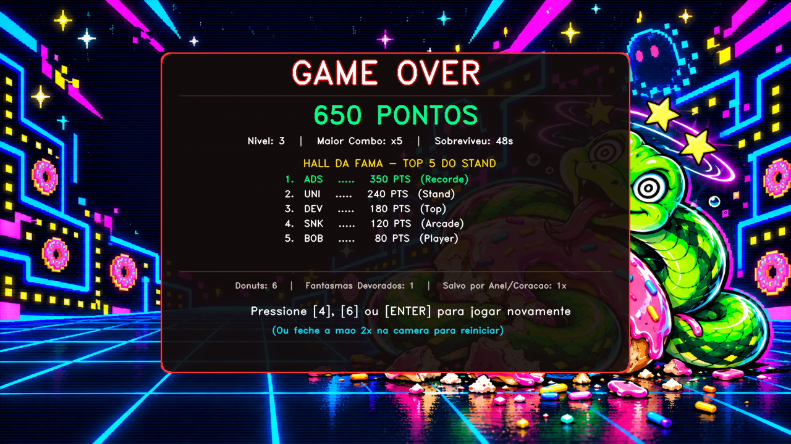
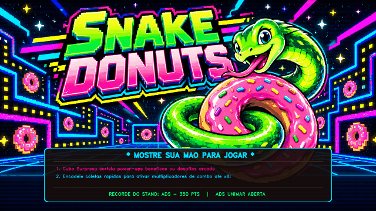

<div align="center">

# 🐍🍩 SnakeDonuts — Neon Arcade
### *Experiência de Fliperama por Visão Computacional para a Unimar Aberta*

[](https://www.python.org/)
[](https://opencv.org/)
[](https://developers.google.com/mediapipe)
[](https://unimar.br/)

---

<p align="center">
  <b>Controle uma cobra arcade neon utilizando apenas a ponta do seu dedo indicador no ar!</b><br>
  Sem teclado, sem mouse e sem controles físicos: pura visão computacional com detecção biométrica em tempo real.
</p>

</div>

---

## 📸 CAPTURAS OFICIAIS DO JOGO

### 1. Tela Inicial e Modo de Apresentação (Attract Mode)


### 2. Tela de Game Over e Hall da Fama (Top 5 Recordes)


### 3. Demonstração de Gameplay em Tempo Real

*(Vídeo completo em alta definição disponível em [assets/gameplay_demo.mp4](assets/gameplay_demo.mp4))*

---

## 🎮 SOBRE O PROJETO

O **SnakeDonuts** é uma experiência de fliperama desenvolvida para o stand do curso de Análise e Desenvolvimento de Sistemas (ADS) na **Unimar Aberta**. 

Utilizando visão computacional (MediaPipe + OpenCV), o visitante guia a cobra no ar com a ponta do indicador, coleta donuts e power-ups retrô, constrói combos explosivos, enfrenta fantasmas e tenta registrar suas três iniciais no Hall da Fama do stand.

Toda a física, movimentação de entidades, cooldowns e temporizadores operam com **tempo monotônico e delta time**, garantindo jogabilidade justa e consistente independentemente da taxa de quadros (FPS) do computador.

---

## 🕹️ COMO JOGAR

1. **Posicione-se em frente à câmera** (a cerca de 1,0 m a 1,5 m de distância).
2. **Aponte o dedo indicador** para a tela. A cobra seguirá a ponta do seu dedo suavemente.
3. **Colete Donuts** para crescer o corpo e acumular pontos.
4. **Devore itens especiais** para obter escudos, segundas chances e bônus de combo.
5. **Evite colisões:** encostar no próprio corpo ou no fantasma é fatal, a menos que você possua um **Anel Dourado** ou um **Coração Pixel**.
6. **Construa combos:** coma itens em sequência rápida para elevar o multiplicador de pontuação de **x1 até x8**!

---

## 🍩 ITENS, POWER-UPS E MECÂNICAS ARCADE

Todos os sprites são originais, possuem transparência alfa e harmonizam com a paleta oficial Neon Arcade:

| Ícone | Item | Efeito | Pontuação Base |
| :---: | :--- | :--- | :---: |
| 🍩 | **Donut Rosa** | Alimento primário. Aumenta o corpo da cobra e eleva o combo. | **+100 pts** |
| 🌟 | **Donut Dourado** | Surge via Cubo Surpresa. Donut especial de alto valor. | **+300 pts** |
| 💍 | **Anel Dourado** | **Escudo:** Absorve 1 colisão fatal (fantasma ou autocolisão), concede 1s de invulnerabilidade e emite alerta *SALVO PELO ANEL!* (Máx. 1 escudo). Coletar outro dá pontos extras. | **+150 pts** |
| 💖 | **Coração Pixel** | **Segunda Chance:** Quando ocorre colisão fatal sem escudo, consome o coração antes do Game Over, encurta a cobra para o tamanho seguro, limpa a trajetória e concede 2s de invulnerabilidade. (Máx. 1 vida). | **+200 pts** |
| 📦 | **Cubo Surpresa** | **Roleta Arcade:** Sorteia um efeito anunciado no centro da tela. O primeiro cubo da partida é garantidamente positivo. | **+100 pts** *(+ efeito)* |
| 🍎 | **Maçã Encantada** | Concede 6s de **Invencibilidade Total**, aura arco-íris neon e poder de devorar o fantasma. | **+150 pts** |
| 🧪 | **Poção Mágica** | Encurta o comprimento da cobra em **45%**, aliviando o risco de colisão em níveis avançados. | **+100 pts** |
| 🪙 | **Super Moeda** | Pontuação massiva que desperta e atrai o Fantasma Perseguidor. | **+250 pts** |
| 👻 | **Fantasma** | Persegue a cobra com velocidade calculada por física real. Encostar nele consome escudo/vida ou encerra a partida. Se devorado durante a Maçã: | **+500 pts** |

### Efeitos Possíveis do Cubo Surpresa:
- **Positivos (85% de probabilidade):**
  - Bônus instantâneo de **+300 pontos**.
  - Redução de **35% do corpo** da cobra.
  - Ativação imediata do escudo do **Anel Dourado**.
  - **5 segundos de invencibilidade total**.
  - **Combo congelado** por 5 segundos (barra não decai).
  - Transformação do Donut comum em **Donut Dourado**.
- **Riscos (15% de probabilidade - nunca no primeiro cubo):**
  - Invocação imediata de um Fantasma.
  - Aumento temporário da velocidade do Fantasma por 5s.
  - Janela de combo reduzida temporariamente.

---

## 📈 SISTEMA DE NÍVEIS E PROGRESSÃO

A dificuldade é progressiva e baseada em mérito, desbloqueando novos recursos a cada patamar:

- **Nível 1 — Aquecimento:** Donuts normais. Ritmo acessível e acolhedor para novos visitantes.
- **Nível 2 — Correria Açucarada (400 pts):** Desbloqueio da Maçã Encantada e da Super Moeda. Combos ganham destaque.
- **Nível 3 — Caça Fantasma (1.000 pts):** Desbloqueio da Poção Mágica e do Anel Dourado. Fantasmas surgem periodicamente.
- **Nível 4 — Caixa de Surpresas (1.800 pts):** Desbloqueio do Cubo Surpresa. Janela de combo ligeiramente menor.
- **Nível 5 — Segunda Chance (2.800 pts):** Desbloqueio do raro Coração Pixel. Fantasmas mais rápidos e persistentes.
- **Níveis 6+:** Desafio contínuo com bônus de nível incrementais (`nível × 200 pts`).

Ao subir de nível, uma faixa em destaque é exibida por 0,85s informando o novo nível, nome da zona e mecânica desbloqueada, acompanhada de fanfarra sonora.

---

## 🔥 MULTIPLICADORES DE COMBO & PONTUAÇÃO

A pontuação premia a agilidade do visitante com uma barra de tempo regressiva no HUD:

- **1 item:** Multiplicador base **x1**
- **2 itens rápidos:** Multiplicador **x2**
- **4 itens rápidos:** Multiplicador **x3**
- **7 itens rápidos:** Multiplicador **x5**
- **11+ itens rápidos:** Multiplicador máximo **x8**!

Ao final da partida, o jogo compila estatísticas detalhadas: pontuação total, nível alcançado, maior combo registrado, tempo de sobrevivência, donuts comidos, fantasmas devorados e total de vezes salvo por Anel ou Coração.

---

## ⌨️ PAINEL DO OPERADOR DO STAND (CONTROLES)

A barra inferior exibe o status de operação em tempo real com atalhos acessíveis pelo teclado superior ou numérico (*Num Lock*):

| Tecla | Comando | Descrição |
| :---: | :--- | :--- |
| **`0`** | **Ajuda** | Abre/fecha painel modal translúcido com todas as instruções. |
| **`1`** | **Trocar Câmera** | Alterna ciclicamente entre as webcams USB conectadas no computador. |
| **`2` / `TAB`** | **Tela Cheia** | Alterna entre modo janela e tela cheia para TV ou telão. |
| **`3`** | **Espelhar** | Inverte o vídeo horizontalmente (efeito espelho natural para o visitante). |
| **`4`** | **Reiniciar** | Reinicia a partida imediatamente a qualquer momento. |
| **`5`** | **Som** | Liga ou silencia todos os efeitos sonoros. |
| **`6` / `ENTER`** | **Ação** | Inicia nova partida ou confirma iniciais no Hall da Fama. |
| **`ESC`** | **Sair** | Encerra o jogo com segurança e libera a webcam. |
| ✊ **Gesto** | **Mão Fechada 2x** | Fechar o punho duas vezes na frente da câmera reinicia a partida sem tocar no teclado. |

---

## 🛡️ ESTABILIDADE E TOLERÂNCIA A PERDA DE TRACKING

- **Tolerância Curta (Grace Period de 1,2s):** Se a mão sair momentaneamente do enquadramento, a movimentação da cobra e as colisões são pausadas de forma justa com o aviso `MÃO NÃO DETECTADA`.
- **Retorno Suave:** Ao recolocar a mão na câmera, a posição da cabeça é reancorada suavemente, **sem criar segmentos gigantes** e sem provocar autocolisão acidental.
- **Modo Demonstração (Attract Mode):** Se a câmera permanecer ociosa por mais de 3,5 segundos, o jogo entra em modo de apresentação com letreiros neon, instruções e recordes para atrair novos visitantes.
- **Gravação Atômica do Leaderboard:** O arquivo `leaderboard.json` é gravado utilizando arquivos temporários e substituição atômica no sistema operacional, evitando corrupção de dados caso o computador seja desligado inesperadamente.

---

## 🎨 IDENTIDADE VISUAL OFICIAL (NEON ARCADE)

Paleta padronizada de alto contraste:
- **Cyber Green (`#00FF88`):** Cabeça da cobra, recordes e confirmações.
- **Electric Cyan (`#00E5FF`):** Bordas translúcidas, UI e HUD superior.
- **Synth Pink (`#FF007F`):** Donut padrão, combos e alertas.
- **Golden Glow (`#FFD700`):** Anel Dourado, Cubo Surpresa e Top 1.
- **Ghost Crimson (`#FF3232`):** Fantasmas, Coração Pixel e avisos de risco.
- **Dark Void (`#0A0D14`):** Fundo translúcido e caixas de diálogo.

---

## 📁 ESTRUTURA DO PROJETO E ASSETS

```
SnakeDonuts/
├── assets/                             # Sprites e telas oficiais
│   ├── title_screen_arcade_v2.png      # Arte oficial da tela inicial
│   ├── game_over_arcade_v2.png         # Arte oficial de game over
│   ├── screenshot_title_screen.png     # Captura oficial da tela inicial (painel inferior carrossel)
│   ├── screenshot_game_over.png        # Captura oficial de game over (ranking 1. a 5.)
│   ├── anel_dourado.png                # Sprite original Neon Arcade do Anel Dourado (Escudo)
│   ├── coracao_pixel.png               # Sprite original Neon Arcade do Coração Pixel (Segunda Chance)
│   ├── cubo_surpresa.png               # Sprite original Neon Arcade do Cubo Surpresa (Roleta)
│   ├── donut_dourado.png               # Sprite original Neon Arcade do Donut Dourado
│   ├── Donut.png                       # Sprite do Donut Rosa
│   ├── Potion.png                      # Sprite da Poção Mágica
│   ├── coin.png                        # Sprite da Super Moeda
│   ├── ghost1.png, ghost2.png          # Fantasmas normais
│   ├── ghost3.png                      # Fantasma assustado
│   ├── enchanted_apple.gif             # Animação da Maçã Encantada
│   ├── AnelSonic.gif                   # Asset preservado original do usuário
│   ├── coracao.png                     # Asset preservado original do usuário
│   └── cuboMario.png                   # Asset preservado original do usuário
├── game_config.py                      # Constantes, níveis, cores e balanceamento
├── game_audio.py                       # Motor de áudio retrô com fila single-worker thread-safe
├── leaderboard_manager.py              # Hall da Fama TOP 5 atômico com validação JSON
├── game_state.py                       # Motor de regras, física, combos, itens e colisões
├── game_renderer.py                    # Renderizador visual com fallback seguro e carrossel
├── stand_utils.py                      # Gerenciamento de câmera, atalhos e janelas
├── main.py                             # Orquestrador do loop de visão computacional
├── SnakeDonuts.py                      # Ponto de entrada secundário com bootstrap de path
├── test_game_logic.py                  # Suíte com 23 testes unitários automatizados
├── stand_config.json                   # Configurações locais persistentes
├── leaderboard.json                    # Recordes persistentes do stand
├── INICIAR_JOGO.bat                    # Script de inicialização em 1-clique
└── requirements.txt                    # Dependências testadas e validadas
```

> [!NOTE]
> **Sobre os Sprites Originais vs. Preservados:**  
> Os arquivos `AnelSonic.gif`, `coracao.png` e `cuboMario.png` originais foram preservados integralmente na pasta `assets/`. Para o evento da Unimar Aberta e futuras publicações públicas/acadêmicas, foram criados sprites exclusivos (`anel_dourado.png`, `coracao_pixel.png`, `cubo_surpresa.png`) para evitar uso de marcas e propriedades intelectuais de terceiros (Sonic, Mario), além de garantir transparência RGBA limpa e fidelidade total à paleta Neon Arcade oficial. Caso deseje alternar, os arquivos originais estão mantidos.

---

## 🚀 INSTALAÇÃO E EXECUÇÃO

### 1. Pré-requisitos
- **Sistema Operacional:** Windows 10 ou 11 (64-bit).
- **Python:** Versão 3.10, 3.11 ou 3.12 (64-bit).
- **Webcam:** Qualquer webcam USB ou integrada (resolução 720p ou 1080p).
- **Internet:** Necessária apenas para instalação inicial das dependências; **o evento opera 100% offline**.

### 2. Instalação das Dependências
```bash
# Recomendado: criar e ativar ambiente virtual
python -m venv .venv
.venv\Scripts\activate

# Instalar dependências validadas
pip install -r requirements.txt
```

### 3. Execução
- **Modo Stand (Mais Fácil):** Dê dois cliques no arquivo **`INICIAR_JOGO.bat`**.
- **Pelo Terminal:**
```bash
python main.py
```

### 4. Execução dos Testes Automatizados (23 Testes)
O projeto está configurado como pacote autocontido com bootstrap automático de caminhos, podendo ser testado tanto de dentro da pasta `SnakeDonuts` quanto a partir do diretório pai:

```bash
# Execução direta dentro da pasta SnakeDonuts:
python -m unittest test_game_logic.py -v

# Execução a partir do diretório raiz C:\dev\Opencv:
python -m unittest discover -s SnakeDonuts -p "test_*.py" -v
```

---

## 🗃️ STATUS DO REPOSITÓRIO GIT

O diretório `SnakeDonuts` é completamente autocontido e independente, não possuindo acoplamento com o restante de `C:\dev\Opencv`. 
- Caso prefira mantê-lo como pasta do projeto pai, basta comitá-lo normalmente a partir de `C:\dev\Opencv`.
- Caso prefira torná-lo um **repositório Git independente** dedicado exclusivamente ao stand, basta executar no terminal dentro de `SnakeDonuts`:
  ```bash
  cd C:\dev\Opencv\SnakeDonuts
  git init
  git add .
  git commit -m "feat: SnakeDonuts Neon Arcade Stand Edition"
  ```
  *(Por segurança e respeito às diretrizes do usuário, o agente não inicializa ou altera repositórios Git automaticamente sem autorização explícita).*

---

## 🔍 DIAGNÓSTICO DE CÂMERA

Caso a webcam não abra de primeira, execute o diagnóstico rápido pelo terminal:
```bash
python -c "import stand_utils; cap, idx = stand_utils.encontrar_camera(retornar_indice=True); print('Camera conectada no indice:', idx)"
```
Se houver mais de uma câmera conectada, use a tecla **`1`** durante a execução do jogo para alternar imediatamente.

---

## 💡 RECOMENDAÇÕES PARA O DIA DO STAND

1. **Posicionamento:** Posicione a câmera a cerca de 1,2 m de altura, apontada para a frente, a uma distância de 1 a 1,5 metro do visitante.
2. **Iluminação:** Utilize iluminação difusa frontal. Evite janelas ensolaradas ou lâmpadas fortes diretamente atrás do jogador (contra-luz).
3. **Tela Cheia:** Pressione **`2`** ou **`TAB`** assim que o jogo inicializar para apresentação limpa na TV ou telão.
4. **Volume:** Pressione **`5`** para silenciar caso o ambiente do pavilhão exija silêncio sonoro.

---

## ⚠️ LIMITAÇÕES CONHECIDAS

1. **Efeitos Sonoros:** O motor de áudio utiliza a síntese procedural `winsound` nativa do Windows; em outros sistemas operacionais, o jogo opera normalmente em modo silencioso.
2. **Ambiente com Múltiplas Mãos:** O modelo do MediaPipe está configurado para rastrear `maxHands=1` para evitar interferência de espectadores ao lado do jogador principal.
3. **Contraluz Intensa:** Luzes de alta intensidade apontadas diretamente para a lente da câmera podem degradar a detecção dos landmarks da mão.

---

## 🏆 CRÉDITOS E TECNOLOGIAS

- **Google MediaPipe:** Rede neural para rastreamento biométrico de landmarks da mão.
- **OpenCV:** Captura e manipulação matricial de vídeo em tempo real.
- **CVZone:** Módulo utilitário para visão computacional.
- **Pillow (PIL):** Processamento gráfico e animação de sprites.
- **Curso de ADS / Unimar Aberta:** Concepção, design e realização para a feira acadêmica.
